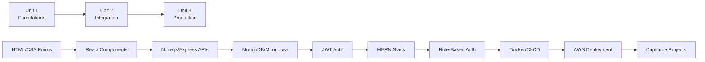

# 📚 Full Stack-I — Complete Syllabus Analysis

> **Course:** CONT_24CSP-293 :: FULL STACK-I  
> **University:** Chandigarh University  
> **LMS:** lms.cuchd.in  
> **Student:** Ariv Kansal 
> **Scraped:** April 24, 2026

---

## Course Overview

**Full Stack Development – 1** introduces students to the fundamentals of building complete web applications by integrating **frontend, backend, and database technologies**. The course emphasizes a **hands-on, project-based approach**.

### Learning Progression
```
HTML5/CSS3/JS → React.js → Node.js/Express.js → MongoDB/Mongoose → MERN Integration → Auth/Security → Docker/CI-CD → AWS Deployment
```

### Course Outcomes (COs)

| CO | Description |
|----|-------------|
| CO1 | Explain fundamental concepts of front-end and back-end development (HTML, CSS, JS, React.js, Node.js, databases) |
| CO2 | Develop interactive and responsive front-end applications using HTML, CSS, JavaScript, and React.js |
| CO3 | Implement RESTful APIs and integrate databases (MongoDB/MySQL) with backend server using Node.js and Express.js |
| CO4 | Debug, test, and optimize full-stack applications by analyzing performance and security aspects |
| CO5 | Design and deploy a full-stack web application with front-end, back-end, authentication, and database integration |

### Core Technology Stack

| Layer | Technologies |
|-------|-------------|
| **Frontend** | HTML5, CSS3, JavaScript, React 18+, Material UI, Bootstrap |
| **Backend** | Node.js 18+, Express.js |
| **Database** | MongoDB 6.0+, Mongoose |
| **Auth** | JWT, bcrypt, React Hook Form |
| **DevOps** | Docker, GitHub Actions, Terraform |
| **Cloud** | AWS (EC2, ECS, ALB, RDS, DynamoDB) |
| **Tools** | VS Code, Postman, Chrome DevTools, Artillery, Redis |

---

## 📖 Unit 1 — Frontend Development & Backend Basics

> **Focus:** HTML/CSS/JS fundamentals → React components & state → Node.js/Express intro

---

### Experiment-1.1: HTML/CSS/JavaScript Foundations

#### Experiment 1.1.1 — Student Registration Form
- **Aim:** Create a student registration form with HTML5 validation for name, email, and age inputs
- **COs Mapped:** CO1, CO2
- **Objectives:**
  - Design a responsive form using semantic HTML5
  - Implement client-side validation using HTML5 attributes
  - Style form elements with CSS3
  - Handle validation feedback visually
- **Tech:** HTML5, CSS3, browser built-in validation
- **Hardware:** Intel i3/Ryzen 3+, 4GB RAM

#### Experiment 1.1.2 — Interactive Web Page
- **Aim:** Build an interactive web page with JavaScript DOM manipulation
- **Objectives:**
  - Dynamic content updates via JS
  - Event handling and DOM traversal
  - CSS animations and transitions
- **Tech:** HTML5, CSS3, Vanilla JavaScript

#### Experiment 1.1.3 — Admin Dashboard with Dark/Light Mode
- **Aim:** Create an admin dashboard layout with dark/light theme toggle
- **Objectives:**
  - CSS Grid/Flexbox dashboard layout (Navigation, Analytics, Users, Settings cards)
  - JavaScript theme toggling with CSS custom properties
  - Responsive design patterns
- **Tech:** HTML5, CSS3 (Grid, custom properties), JavaScript DOM

---

### Experiment-1.2: React Fundamentals

#### Experiment 1.2.1 — React Component Basics
- **Aim:** Introduction to React components, JSX, and basic rendering
- **Objectives:**
  - Create functional components
  - Understand JSX syntax
  - Component composition and rendering
- **Tech:** React 18+, VS Code, Chrome DevTools

#### Experiment 1.2.2 — Dynamic Product Filter
- **Aim:** Create a dynamic product filter that sorts items based on dropdown selection
- **Objectives:**
  - Implement filterable product data
  - Create sortable dropdown UI
  - Add responsive product cards
  - Animate layout transitions
- **About:** Demonstrates array manipulation, React state management, and CSS Grid layouts for responsive product displays
- **Tech:** React 18+, CSS Grid

#### Experiment 1.2.3 — React State & Events
- **Aim:** Practice React state management and event handling patterns
- **Objectives:**
  - useState hook for state management
  - Event handlers and conditional rendering
  - Lifting state up
- **Tech:** React 18+

---

### Experiment-1.3: React Component Architecture

#### Experiment 3.1 — ProductCard Component
- **Aim:** Create a reusable ProductCard component that displays product information using React props
- **COs Mapped:** CO1, CO2
- **Objectives:**
  - Design a responsive product card
  - Implement props for dynamic data
  - Style with modern CSS techniques
  - Display stock status visually
- **Tech:** React 18+, VS Code, Chrome DevTools

#### Experiment 3.2 — Component Composition
- **Aim:** Build composite React components using children and composition patterns
- **Tech:** React 18+

#### Experiment 3.3 — Advanced Component Patterns
- **Aim:** Implement advanced React patterns (controlled components, render props)
- **Tech:** React 18+

---

### Experiment-1.4: Node.js & Express.js Introduction

#### Experiment 4.1 — Employee Management System (CLI)
- **Aim:** Build a terminal-based Employee Management System with CRUD operations
- **Objectives:**
  - CLI menu system (Add, List, Update, Delete, Exit)
  - In-memory data management with Node.js
  - Input parsing and validation
- **Tech:** Node.js 18+, Terminal/Command Prompt
- **Output:** Interactive terminal CRUD menu

#### Experiment 4.2 — REST API for Playing Card Collection
- **Aim:** Develop a RESTful API for managing playing card collections using Express.js
- **Objectives:**
  - RESTful route design (GET, POST, PUT, DELETE)
  - Express.js middleware and routing
  - API testing with Postman
- **Tech:** Node.js 18+, Express.js, Postman, MongoDB (optional)
- **Output:** Server running on port 3000, API endpoints at `/api/cards`

#### Experiment 4.3 — Concurrent Ticket Booking System
- **Aim:** Create a concurrent ticket booking system with seat locking using Redis
- **Objectives:**
  - Concurrent request handling
  - Redis-based distributed locking
  - Load testing with Artillery
- **Tech:** Node.js 18+, Express.js, Redis, Artillery

---

## 📖 Unit 2 — Backend Development & Full Stack Integration

> **Focus:** MongoDB/Mongoose → Express middleware/auth → MERN stack integration → Real-time features

---

### Experiment-2.1: MongoDB & Mongoose

#### Experiment 2.1.1 — Mongoose CRUD Operations
- **Aim:** Demonstrate basic database operations using Mongoose with schema validation and custom instance methods
- **Objectives:**
  - Define Mongoose schemas with validation
  - CRUD operations (Create, Read, Update, Delete)
  - Custom instance methods
  - Pagination concepts
- **Tech:** Node.js 18+, MongoDB 6.0+, Postman/REST Client
- **Hardware:** i5+ CPU, 8GB RAM
- **Expected Output:** JSON product documents with `_id`, name, price, category, inStock, createdAt
- **Viva Questions:**
  1. What's the purpose of Mongoose middleware?
  2. How does schema validation differ from application validation?
  3. When should you use findByIdAndUpdate vs save()?
  4. How would you implement pagination?

#### Experiment 2.1.2 — Student Management System (Full CRUD)
- **Aim:** Build a Student Management System with React frontend and MongoDB backend
- **Objectives:**
  - Full CRUD operations with a visual UI
  - Student cards with Name, Roll, Edit/Delete buttons
  - "New Student" creation form
- **Tech:** React, Express.js, MongoDB, Mongoose
- **Output:** Student Management System with CRUD card interface

#### Experiment 2.1.3 — Advanced Mongoose Queries
- **Aim:** Complex querying, indexing, and aggregation with Mongoose
- **Tech:** MongoDB, Mongoose

---

### Experiment-2.2: Express Middleware & Authentication

#### Experiment 2.2.1 — Express Middleware Pipeline
- **Aim:** Implement custom middleware chain in Express
- **Objectives:**
  - Request/response pipeline understanding
  - Middleware chaining with `next()`
  - Error handling middleware
  - Authentication patterns
  - Request logging
- **Tech:** Node.js 18+, Express.js, MongoDB, Postman
- **Output:**
  - Request logs displayed in console
  - Protected route access with valid token
  - 401 errors for unauthorized access
  - Error handling for internal server issues
  - Middleware executes in correct sequence
- **Viva Questions:**
  1. What is middleware in Express?
  2. How does the next() function work?

#### Experiment 2.2.2 — JWT Authentication System
- **Aim:** Implement secure user authentication with JWT
- **Objectives:**
  - Password hashing using bcrypt
  - JWT signing and verification
  - Secure route protection
  - Token expiration and refresh
  - Securing sensitive user data
- **Tech:** Node.js, Express.js, MongoDB, jsonwebtoken, bcrypt
- **Output:**
  - User registration and login functionality
  - JWT generation on successful login
  - Protected route access using tokens
  - Expiry and invalid token handling
  - Passwords stored securely in the database
- **Viva Questions:**
  1. Why is password hashing necessary?
  2. What is the significance of JWT expiration?
  3. How do refresh tokens enhance security?
  4. What are the common JWT security risks?
  5. How can brute-force login attempts be prevented?

#### Experiment 2.2.3 — Advanced Authentication Patterns
- **Aim:** Implement refresh tokens, OAuth concepts, and session management
- **Tech:** Express.js, JWT, bcrypt

---

### Experiment-2.3: Full Stack Integration (MERN)

#### Experiment 2.3.1 — React-Express Integration with Axios
- **Aim:** Connect React frontend to fetch data from Express API using Axios
- **COs Mapped:** CO3, CO4, CO5
- **Objectives:**
  1. Create RESTful API endpoints in Express
  2. Develop React components for data display
  3. Implement Axios for HTTP requests
  4. Handle loading and error states
  5. Style UI with Bootstrap
- **Tech:** React 18+, Express.js, Axios, Bootstrap, MongoDB

#### Experiment 2.3.2 — Shopping Cart Application
- **Aim:** Build a full-stack shopping cart with real-time price calculations
- **Objectives:**
  - Product listing with Price, Quantity, Actions
  - Add/Remove items, quantity adjustment
  - Dynamic total calculation
- **Tech:** React, Express.js, MongoDB
- **Output:** Cart UI with products (Smartphone $299.99, Tablet $449.99, Smartwatch $199.99), quantity controls, Remove buttons, running Total

#### Experiment 2.3.3 — Real-Time Chat Application with Socket.IO
- **Aim:** Build a real-time chat application using WebSocket (Socket.IO)
- **Objectives:**
  - Bidirectional real-time communication
  - User registration, messaging, online status tracking
  - Typing indicators
- **Tech:** React 18+, Socket.IO, Material UI v5.14+, VS Code, WebSocket Tester (Browser Extension)
- **Expected Output:**
  1. Login Screen: Username input + "Enter Chat" button
  2. Chat Interface: Header with online users, message display with avatars/timestamps, typing indicators, auto-scrolling
  3. Real-time Updates: Instant message broadcasting, live online user list, typing indicators

### Experiment-2.4: *(Empty/Placeholder — No content)*

---

## 📖 Unit 3 — Advanced Features, DevOps & Capstone Projects

> **Focus:** Full authentication flow → Docker/CI-CD → AWS deployment → Capstone projects

---

### Experiment-3.1: Authentication & Authorization

#### Experiment 3.1.1 — Client-Side Authentication Flow
- **Aim:** Implement client-side authentication with form validation and state handling using React hooks
- **Objectives:**
  - Login form with validation (React Hook Form)
  - Loading spinner on submit
  - Success and error alerts
  - Controlled inputs
- **Tech:** React 18+, React Hook Form 7.49+, Material UI 5.14+, VS Code

#### Experiment 3.1.2 — Backend-Verified Protected Routes with JWT
- **Aim:** Showcase backend-verified protected routes using JWT in React and Express
- **Objectives:**
  - JWT verification on server
  - Login redirect for unauthenticated users
  - Token storage in localStorage
  - Protected route access for authenticated users
- **Tech:** React, Express.js, JWT, Axios 1.6+
- **Output:** Server running on port 3001, API endpoints for login and protected routes

#### Experiment 3.1.3 — Admin Management with Role-Based Access Control
- **Aim:** Enable admins to manage users and restrict features based on roles
- **Objectives:**
  - Admin-only dashboard
  - Unauthorized users blocked
  - Role-based menus
  - Permission-controlled APIs
- **Tech:** React, Express.js, JWT, MongoDB
- **Output:** Access Denied page for unauthorized users, Admin Dashboard link, User Profile link

---

### Experiment-3.2: DevOps & Deployment

#### Experiment 3.2.1 — Docker Containerization of React Apps
- **Aim:** Containerize React applications using Docker's multi-stage build process for production
- **Objectives:**
  - Multi-stage Docker builds
  - Nginx as reverse proxy on port 8080
  - Gzip compression
  - Caching headers for static assets
- **Tech:** Docker, Nginx, React
- **Expected Output:**
  - Production-ready Docker image under 100MB
  - React app served via Nginx on port 8080
  - Gzip compression enabled
  - Proper caching headers

#### Experiment 3.2.2 — CI/CD Pipeline with GitHub Actions
- **Aim:** Set up end-to-end CI/CD automation from code commit to production deployment
- **Objectives:**
  - Automated testing on PR creation
  - Docker image built and pushed to GitHub Container Registry
  - Slack notifications on successful deployment
  - Image tagged with "latest" and commit SHA
- **Tech:** GitHub Actions, Docker, GitHub Container Registry, Slack

#### Experiment 3.2.3 — Production Deployment on AWS
- **Aim:** Demonstrate production-grade deployment on AWS with high availability, load balancing, and auto-scaling
- **Deployment Workflow:**
  1. Terraform apply to provision infrastructure
  2. Push code to GitHub to trigger pipeline
  3. Code Pipeline builds and deploys Docker image
  4. ALB distributes traffic across ECS tasks
  5. Auto-scaling adjusts capacity based on CPU load
- **Tech:** AWS (ECS, ALB, Auto-scaling), Terraform, Docker, GitHub
- **Expected Output:**
  - Highly available application across 2 AZs
  - Load-balanced traffic with auto-scaling (2–4 instances)
  - Zero-downtime deployments
  - Infrastructure as Code (IaC) management

---

### Experiment-3.3: Capstone Projects

#### Experiment 3.3.1 — Full-Stack Todo Application
- **Aim:** Build a complete todo application with full CRUD functionality
- **Task Description:**
  - Add new todo items
  - Display the list of existing todos
  - Update todo items (e.g., mark as completed)
  - Delete items from the list
  - Simple, user-friendly styling
- **Expected Output:**
  - A working web app where users can manage their todo items
  - Fully functional CRUD backend connected to a database
  - Clear, user-friendly interface to view and interact with todos

#### Experiment 3.3.2 — Blog Platform with Comments and User Profiles
- **Aim:** Build a full-stack blog platform with user authentication, posts, and comments
- **Objective:** Develop an advanced application managing dynamic user-generated content with relationships between users, posts, and data modeling for comments
- **Task Description:**
  - Users can sign up and create profiles
  - Users can write blog posts, edit, and delete them
  - Other users can view posts and add comments
  - Store user data, posts, and comments in database
  - Build clean frontend (React or similar) and backend API
  - Handle authentication (JWT), CRUD operations, and relational data
- **Expected Output:** Multi-user blogging platform with real-time comment updates

#### Experiment 3.3.3 — Social Media App with AWS Deployment
- **Aim:** Build a social media platform with posts, authentication, and deploy on AWS
- **Objective:** Build a complex real-world project combining frontend, backend, user authentication, and cloud deployment. Learn to make scalable apps and handle real user interactions
- **Task Description:**
  - Register and log in securely
  - Create, edit, and delete posts (with optional images)
  - View posts from other users in a feed
  - Like and comment on posts
  - Build frontend with React (or Next.js), backend with Node.js/Express
  - Use JWT or OAuth for authentication
  - Store data in cloud database (Amazon RDS or DynamoDB)
  - Deploy on AWS (EC2, Elastic Beanstalk, or ECS) with domain, HTTPS, and load balancing

### Experiment-3.4: *(Empty/Placeholder — No content)*

---

## 📊 Syllabus Scope Summary

### Difficulty Progression



### What's Expected for Your Full-Stack Project

Based on the capstone experiments (3.3.1–3.3.3), your final project should demonstrate:

| Requirement | Details |
|------------|---------|
| **Frontend** | React-based SPA with responsive design, routing, state management |
| **Backend** | Express.js REST API with proper middleware chain |
| **Database** | MongoDB with Mongoose schemas, validation, relationships |
| **Authentication** | JWT-based auth with bcrypt password hashing, protected routes |
| **Authorization** | Role-based access control (admin vs. user) |
| **CRUD Operations** | Full Create, Read, Update, Delete for core entities |
| **Real-time** (bonus) | Socket.IO for live features (chat, notifications) |
| **DevOps** (bonus) | Docker containerization, CI/CD pipeline |
| **Deployment** (bonus) | AWS hosting with HTTPS, load balancing |

### Technology Frequency Across All Experiments

| Technology | Appearances | Importance |
|-----------|-------------|------------|
| React 18+ | 15+ experiments | ⭐⭐⭐⭐⭐ Core |
| Node.js/Express | 12+ experiments | ⭐⭐⭐⭐⭐ Core |
| MongoDB/Mongoose | 10+ experiments | ⭐⭐⭐⭐⭐ Core |
| JWT/bcrypt | 5+ experiments | ⭐⭐⭐⭐ Important |
| CSS3/Flexbox/Grid | 5+ experiments | ⭐⭐⭐⭐ Important |
| Postman | 4+ experiments | ⭐⭐⭐ Useful |
| Material UI | 3+ experiments | ⭐⭐⭐ Useful |
| Docker | 3 experiments | ⭐⭐⭐ Useful |
| Socket.IO | 1 experiment | ⭐⭐ Bonus |
| AWS | 2 experiments | ⭐⭐ Bonus |
| Redis | 1 experiment | ⭐ Specialized |
| Terraform | 1 experiment | ⭐ Specialized |

> [!TIP]
> **For your full-stack project**, the sweet spot based on this syllabus is a **MERN stack application** (MongoDB + Express + React + Node.js) with **JWT authentication** and **role-based access**. The capstone experiments (3.3.1-3.3.3) are essentially the project templates your professor expects — a Todo App, Blog Platform, or Social Media App. Your project should be at minimum at the level of Experiment 3.3.2 (Blog Platform) to score well.

> [!IMPORTANT]
> **Experiment-2.4 and Experiment-3.4 are empty placeholders** — no content was uploaded by the instructor. All other experiments (30 total across 3 units) have been fully captured above.
